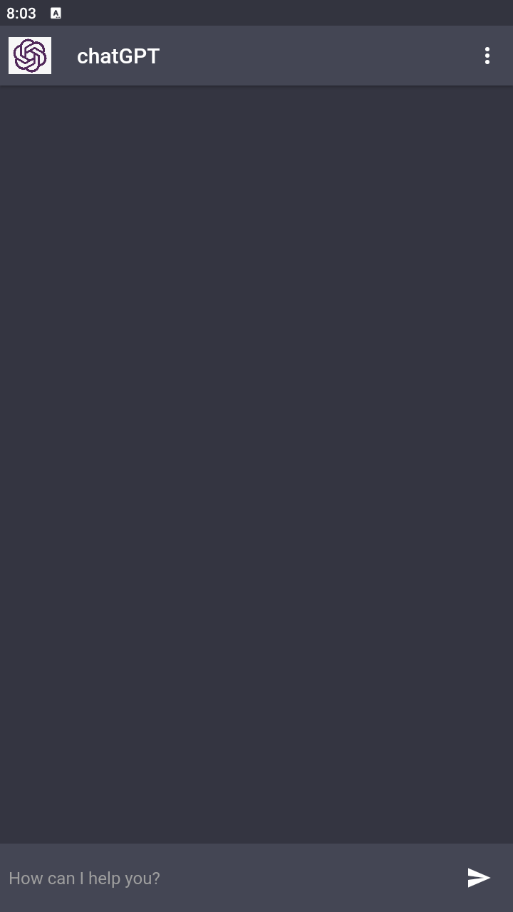
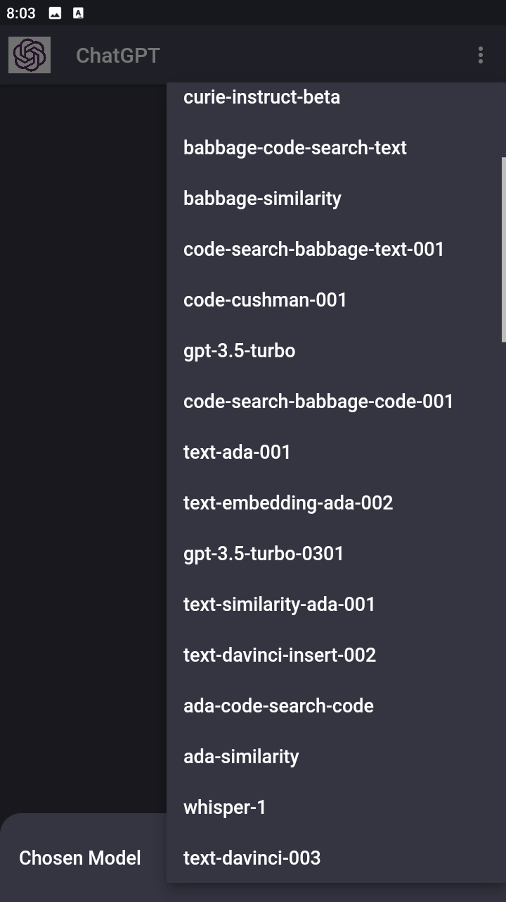
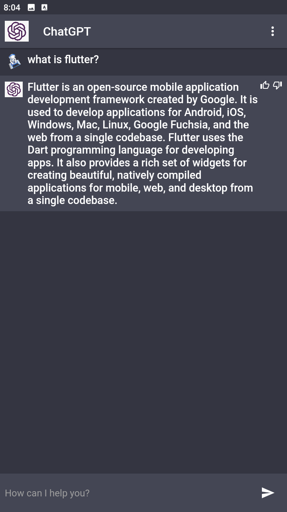

# ChatGPT

A new Flutter project.

## Getting Started
In the lib folder create a folder and name it api, in the api folder create a dart file and name it api.dart
 

<h4>i.e</h4>&nbsp; lib/api/api.dart

 
In the api.dart
 
</h4>set<h4>
 

String BASE_URL = 'https://api.openai.com/v1';

String BASE_API = 'YOUR API KEY';

 
<s>Visit <a href='https://platform.openai.com/account/api-keys'>OpenAI</a> to generate API KEY</s>

## Screen Shots

 
 
 

